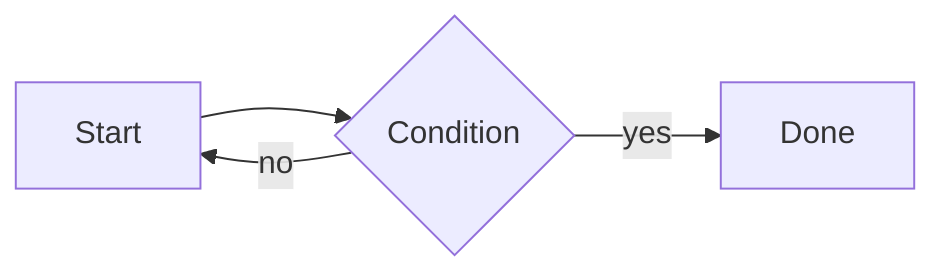

# E2E Test Document

This fixture exercises every public-facing feature of mdview.

## Code blocks

```js
function greet(name) {
  return `Hello, ${name}!`;
}
```

```python
def greet(name):
    return f"Hello, {name}!"
```

## Mermaid diagram



## Image


