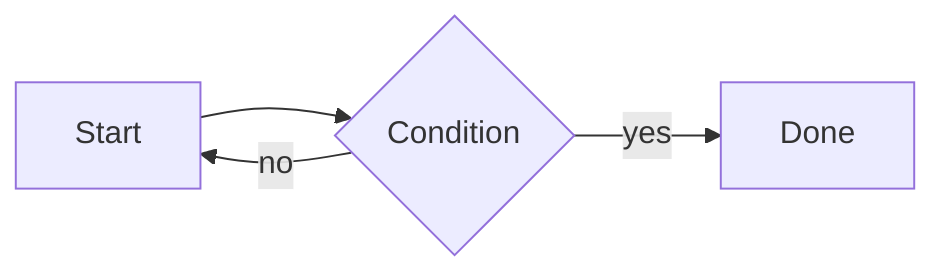

# E2E Test Document

This fixture exercises every public-facing feature of mdview.

## Code blocks

```js
function greet(name) {
  return `Hello, ${name}!`;
}
```

```python
def greet(name):
    return f"Hello, {name}!"
```

## Mermaid diagram



## HTML preview block

```html
<section style="padding:8px;font-family:sans-serif;">
  <h2 style="margin:0 0 4px;color:#0969da;">Hello Preview</h2>
  <p data-testid="html-preview-paragraph">This is rendered inside the iframe.</p>
</section>
```

## Image


