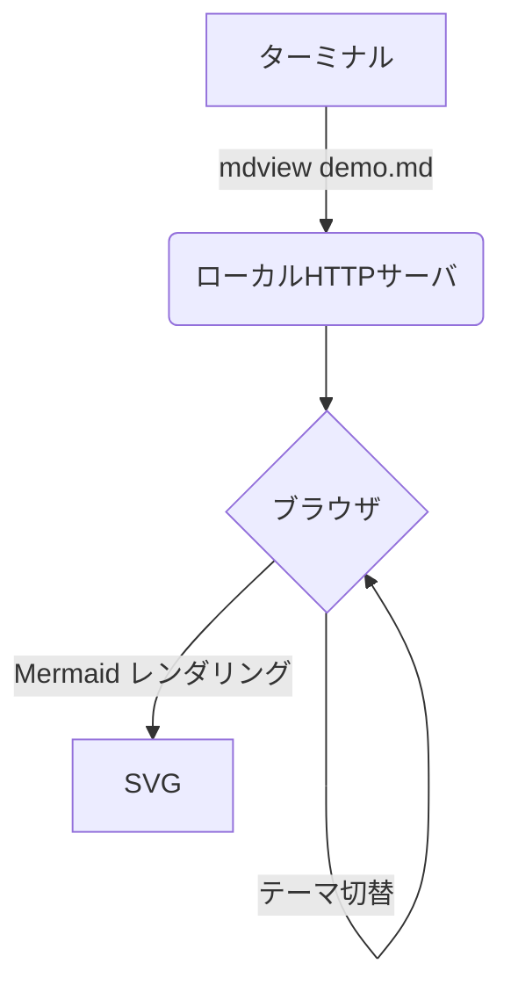
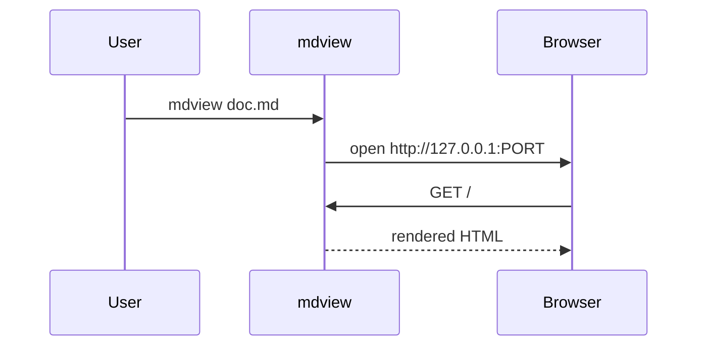

# mdview demo

これは **mdview** のサンプルドキュメントです。

## 特徴

- ターミナルから起動、ブラウザで閲覧
- ライト / ダーク テーマ切替 (右上ボタン)
- Mermaid 図のレンダリング
- ローカル画像の表示

## リスト

- [x] Markdown レンダリング
- [x] Mermaid
- [ ] 自動リロード (未実装)

## 表

| 項目 | 値 |
|------|-----|
| Node | v18+ |
| 依存 | marked のみ |

## コード

```js
function hello(name) {
  return `Hello, ${name}!`;
}
```

## Mermaid 図





## 引用

> 「シンプルなツールが一番長く使われる」

---

## 画像

ローカル相対パスの画像も `./samples/...` からそのまま参照できます。
