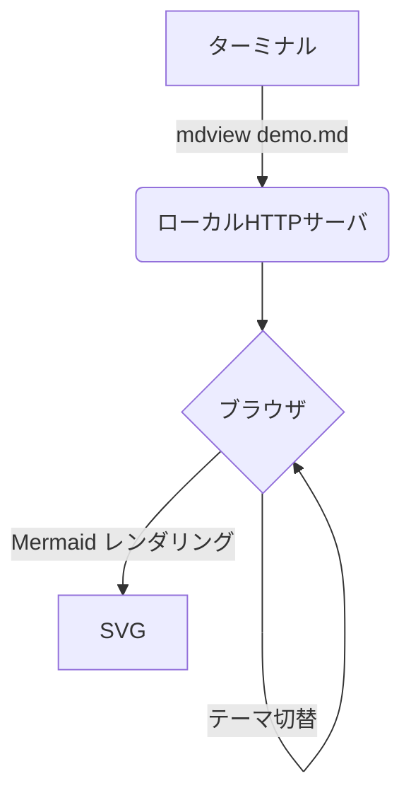
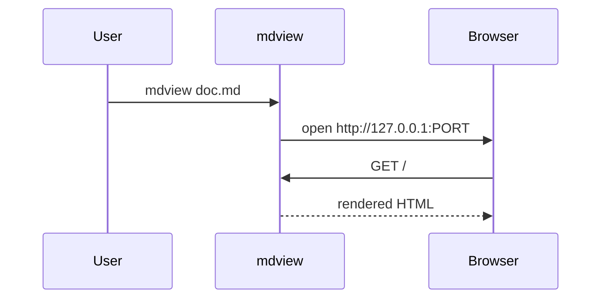

# mdview demo

これは **mdview** のサンプルドキュメントです。

## 特徴

- ターミナルから起動、ブラウザで閲覧
- ライト / ダーク テーマ切替 (右上ボタン)
- Mermaid 図のレンダリング
- シンタックスハイライト (highlight.js)
- ファイル変更時の自動リロード
- ローカル画像の表示

## リスト

ブラウザ上で**チェックボックスをクリック**するとソースファイルに反映されます。

- [x] Markdown レンダリング
- [x] Mermaid
- [x] 自動リロード
- [x] シンタックスハイライト
- [ ] インタラクティブチェックボックス (試しにチェックを入れたり外したりしてみてください)
- [ ] 範囲選択 → 右クリックでコメント追加

## コメント

本文を**範囲選択して右クリック**すると、その場でコメントを追加できます。既存コメントの例:

このパラグラフには <span class="mdview-comment-mark" data-mdview-comment-id="1">マークされた範囲</span> があります。マウスオーバーで吹き出しが表示されます。

<!--mdview-comment[1]: これがコメントの本文です。複数行は 1 行に正規化されます。-->

## 表

| 項目 | 値 |
|------|-----|
| Node | v18+ |
| 依存 | marked のみ |

## コード

JavaScript:

```js
function hello(name) {
  return `Hello, ${name}!`;
}
const greet = hello("mdview");
console.log(greet);
```

Python:

```python
def fibonacci(n):
    a, b = 0, 1
    for _ in range(n):
        yield a
        a, b = b, a + b

print(list(fibonacci(10)))
```

Bash:

```bash
#!/usr/bin/env bash
set -euo pipefail

for f in *.md; do
  echo "Processing $f"
  mdview "$f" --no-open
done
```

JSON:

```json
{
  "name": "mdview",
  "version": "0.2.0",
  "engines": {
    "node": ">=18"
  }
}
```

YAML:

```yaml
name: mdview
runtime: node
features:
  - syntax-highlight
  - live-reload
  - mermaid
```

## Mermaid 図





## 引用

> 「シンプルなツールが一番長く使われる」

---

## 画像

ローカル相対パスの画像も `./samples/...` からそのまま参照できます。
