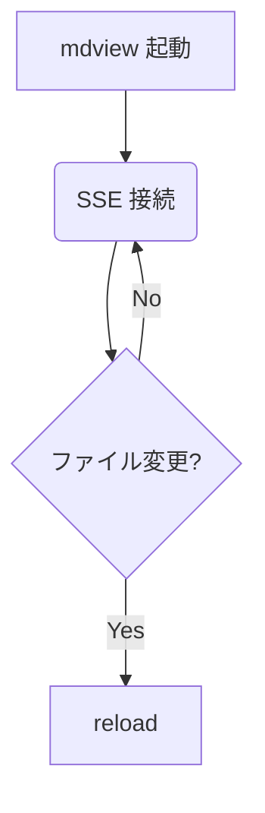

# 上級ガイド

サイドバーやライブリロードを活用したワークフロー例です。

## ライブリロード

mdview はファイル監視を行い、変更を検知すると自動でブラウザをリロードします。

### 監視対象

起動した Markdown の同階層のディレクトリを `fs.watch` で監視しています。

### デバウンス

連続するイベントは 75ms にまとめて 1 度の reload にします。

## テーマ切替

右上のテーマボタンから ライト / ダーク を切り替えられます。設定は `localStorage` に保存され、次回起動時にも引き継がれます。

### prefers-color-scheme との関係

OS の設定 (`prefers-color-scheme`) を初期値として利用しますが、ユーザーが明示的に選択した場合はその選択が優先されます。

## Mermaid 図

## 関連ページ

- [基本ガイド](./basics.md)
- [API リファレンス](../reference/api.md)
